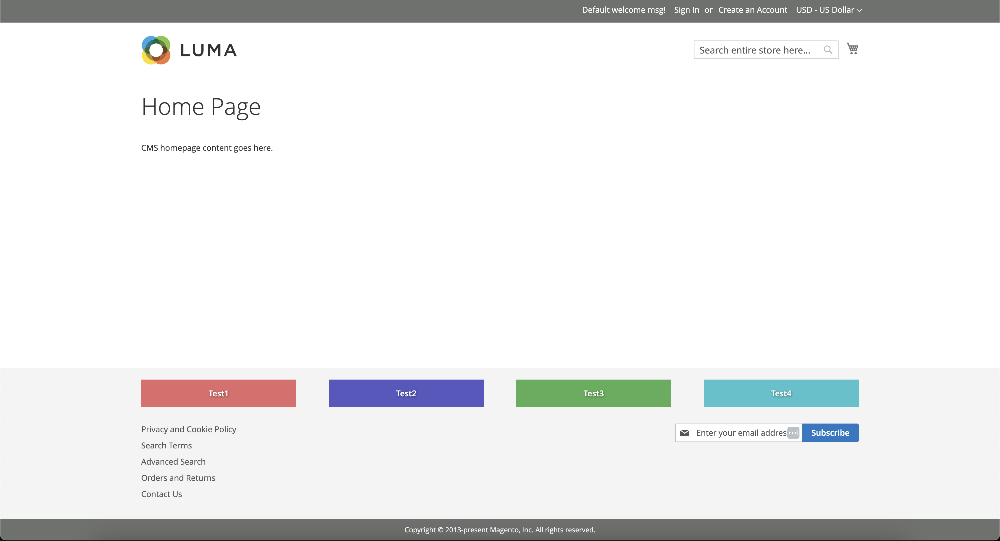

# SamJUK_ExampleFooter

Apart of a collection of modules, to help test/validate deployment processes.

Simple module that adds some dummy content to the page footer when installed. With a feature flag in the system admin to toggle the output.



## Installation
```sh
composer config repositories.samjuk-m2-module-example-footer vcs git@github.com:SamJUK/m2-module-example-footer.git
composer require samjuk/m2-module-example-footer
php bin/magento cache:flush
```

## Feature Flag
The block output can be configured via a feature flag. This can be found in the admin panel under the `System Config > SamJUK > Example Footer > General > Enabled` path. Or set via the CLI with
```sh
php bin/magento config:set samjuk_examplefooter/general/enabled 0
php bin/magento cache:flush
```

## Related Modules

Name | Description | Link
--- | --- | ---
Example Banner | Adds a banner below the header on all pages | https://github.com/SamJUK/samjuk-m2-module-example-banner